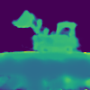
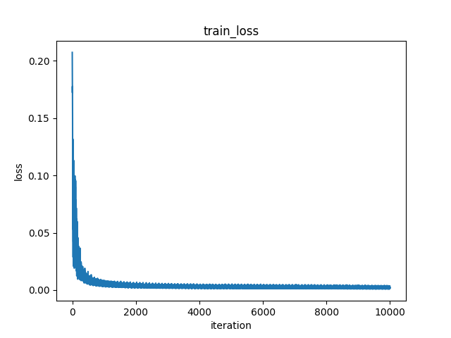
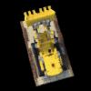

# NeRFHowTo
A vanilla **[Neural Radiance Fields](https://www.matthewtancik.com/nerf)**(**NeRF**) re-implementation with clean and well-annotated PyTorch implementation for systematic learning toward Neural Rendering with Neural Fields method.

NeRF pipeline:


Given a camera pose, generate rays by `ray casting`, then sample points in each ray by `ray sampling`, then embed the point coordinates by `positional encoding`, then feed into the MLP as `neural radiance field`, at last form the output maps from the outputs by `ray marching`.

> Note: 
> 
> `ray casting` and `ray marching` here are not the exactly same as what we commonly refer to in computer graphics, which are commonly compared with ray tracing
> 
> the real forward pipeline is not so direct as described here, you can see `models/pipeline.py` for details

## Support Features
* Clean modularization and decoupling for the five main modules in NeRF, or in neural rendering with neural fields method
* Dataset-train-test-taste complete pipeline
* Faithful re-implementation of original description, with messy things removed and very little bit of optimization added
* Extensibility is provided for using custom datasets, modules and tasting camera settings
* Several common datasets examples with not-too-bad results

## Get Started
```bash
# install dependencies
pip install -r requirements.txt

# prepare your dataset in `data`

# prepare your experiment configuration in `configs`

# observe your dataset
python observe_dataset.py --config configs/*.txt

# train the field
python train.py --config configs/*.txt

# visualize the train process if needed
python train_visualize.py --path logs/* --gif --mp4 --fps 30

# test the field
python test.py --config configs/*.txt

# visualize the test results if needed
python test_visualize.py --path logs/* --gif --mp4 --fps 10

# taste with the field
python taste.py --config configs/*.txt

# visualize the taste results if needed
python taste_visualize.py --path logs/* --taste_type <your_type> --generate_type <your_type> --gif --mp4 --fps 30
```

## Demo
Here I use the commonly-used "hello world" dataset in NeRF field and prepare it with a demo configuration file that can run on your personal normal laptop.

By using `python observe_dataset.py --config configs/helloworld_demo.txt`, you can see the dataset distribution.


By using `python train.py --config configs/helloworld_demo.txt` and then visualize it, you can see the training process. And it only takes use of around *2GB* GPU memory and *30min* time to train, you can enjoy it easily.


By using `python test.py --config configs/helloworld_demo.txt` and then visualize it, you can see the testing dataset's rendering results. And it gets a result of around *24* psnr.


By using `python taste.py --config configs/helloworld_demo.txt` and then visualize them, you can play with different camera settings.





<details><summary>Analysis</summary>

<p>

* advantages: almost all hyperparameters are half of the normal setting so the time-complexity and space-complexity is small enough
* disadvantages: complexity is small so not very good results

</p>

</details>

## Results
### Dataset helloworld
`helloworld` dataset type can refer to `data/README.md`. Training takes around *30GB* GPU memory and around *7h* time (you may need an A100 :), and testing results achieve around *27* psnr.








<details><summary>Analysis</summary>

<p>

* advantages: standard configuration achieves good results
* disadvantages: helloworld dataset's images' resolution is low itself so the detail texture can be hard to learn

</p>

</details>

### Dataset blender
`blender` dataset type can refer to `data/README.md`, here I take `lego`. Training takes around *30GB* GPU memory and around *21h* time (you may need an A100 :), and testing results achieve around *30* psnr.


(sorry the metrics curves are lost due to long time training, but from the results I think it is good enough and no need to look them at details)


<details><summary>Analysis</summary>

<p>

* advantages: lego dataset's images' resolution is high enough and the size of dataset is large enough so the detailed texture is clear enough, the dataset is synthetic with no background and accurate geometry correspondence so the learned field is nice

</p>

</details>

### Dataset llff
`llff` dataset type can refer to `data/README.md`, here I take `fern`. Training takes around *30GB* GPU memory and around *7h* time (you may need an A100 :), and testing results achieve around *21* psnr.


<details><summary>Analysis</summary>

<p>

* disadvantages: from last results we can see it is hard to optimize maybe due to few training sets, when decrease the focal length we see many ghosts outside the focus area so it is useful to check whether the field is nice enough, original implementation here adds noise but for clear I remove it so it causes hardness to optimize

</p>

</details>

### Dataset colmap
`colmap` dataset type can refer to `data/README.md`, here I take `stuff` by myself. Training takes around *25GB* GPU memory and around *20h* time (you may need an A100 :), and testing results achieve around *28* psnr.


<details><summary>Analysis</summary>

<p>

* advantages: laptop power facemask apple pear mouse cup glasses pen are all visible
* disadvantages: since background's depth may be exceed the sampling region I set so it causes hardness to optimize, since background's depth large then the sampling region I set is also large so it causes details hard to be sampled and it can be seen from thin things such as glasses feet

</p>

</details>

## Note
Kudos to the authors for their amazing results.
```bib
@misc{mildenhall2020nerf,
    title={NeRF: Representing Scenes as Neural Radiance Fields for View Synthesis},
    author={Ben Mildenhall and Pratul P. Srinivasan and Matthew Tancik and Jonathan T. Barron and Ravi Ramamoorthi and Ren Ng},
    year={2020},
    eprint={2003.08934},
    archivePrefix={arXiv},
    primaryClass={cs.CV}
}
```

I have used the popular pytorch implementations from [nerf-pytorch](https://github.com/yenchenlin/nerf-pytorch) and colab notebook [nerf from nothing](https://colab.research.google.com/drive/1TppdSsLz8uKoNwqJqDGg8se8BHQcvg_K?usp=sharing) as references.
```bib
@misc{lin2020nerfpytorch,
  title={NeRF-pytorch},
  author={Yen-Chen, Lin},
  publisher = {GitHub},
  journal = {GitHub repository},
  howpublished={\url{https://github.com/yenchenlin/nerf-pytorch/}},
  year={2020}
}
```
```bib
@misc{nerffromnothing,
  title={NeRF From Nothing},
  author={Mason McGough},
  publisher = {Google},
  journal = {Google colab},
  howpublished={\url{https://colab.research.google.com/drive/1TppdSsLz8uKoNwqJqDGg8se8BHQcvg_K?usp=sharing}},
  year={2022}
}
```
